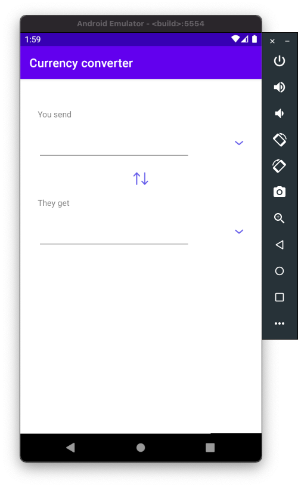
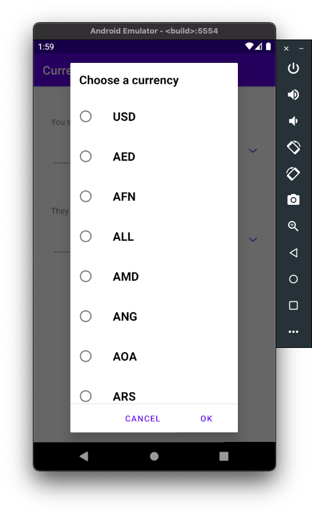
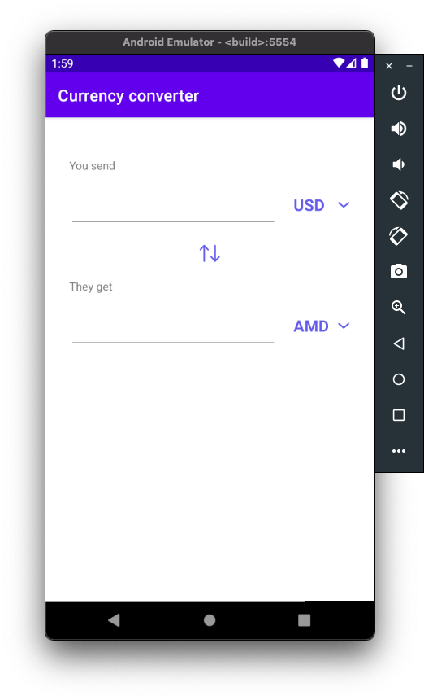
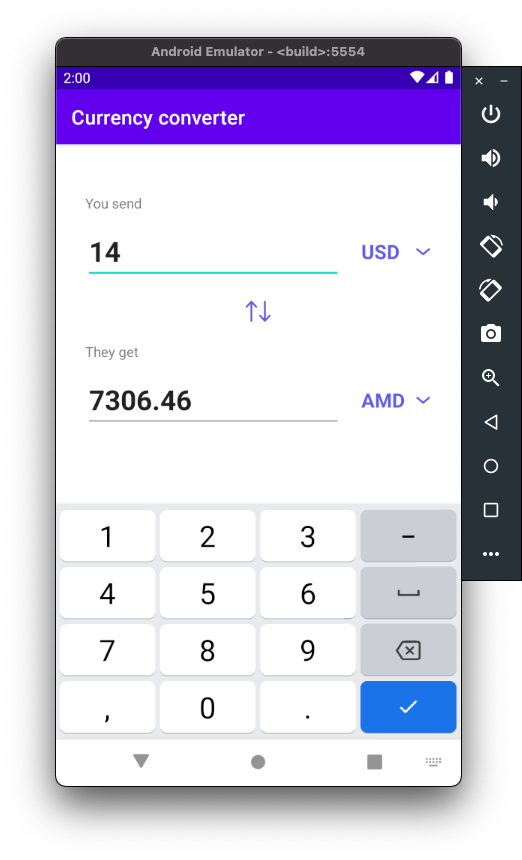

# Приложение по конвертации валют

Приложение позволяет переводить суммы из одной валюты в другую, основываясь на открытых данных [платформы конвертации валюты](https://www.exchangerate-api.com).

Приложение позволяет работать в онлайн и офлайн режиме, однако, если курс конкретной валюты не был получен ранее, то приложение не сможет работать с данной валютой.

Приложение использует следующие технологии:

* MVVM - для структуризации кода и разограничения слоя данных от UI слоя;
* ViewBinding - для более простого взаимодействия с UI версткой;
* Room - для кэширования данных внутри приложения и для реализации возможности оффлайн режима;
* Retrofit - для получения последних значений курса валюты ***(Требует подключение к интернету)***;
* DI - для более простого доступа и работы с различными зависимостями в проекте;

### Скриншоты работы приложения:

